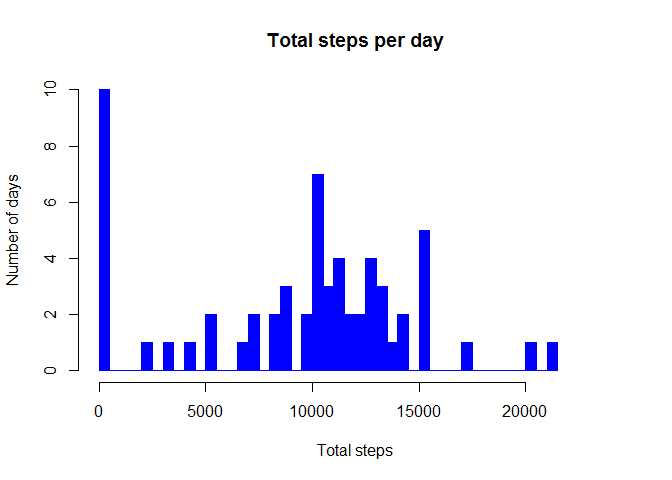
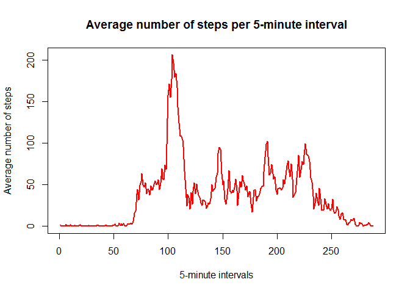
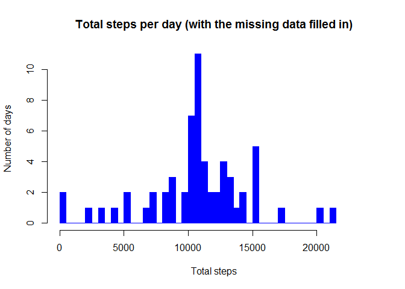

# Reproducible Research: Peer Assessment 1
### 1. Loading and preprocessing the data

Load additional libraries.


```r
library(ggplot2)
library(plyr)  
library(lubridate)  
```

```
## 
## Attaching package: 'lubridate'
## 
## The following object is masked from 'package:plyr':
## 
##     here
```

Create variable for file name and verify if file already exists in working directory.

```r
data_file <- "activity.csv"

if(!file.exists(data_file)){
  url <- "https://d396qusza40orc.cloudfront.net/repdata%2Fdata%2Factivity.zip"
  download.file(url, "activity.zip")
  unzip("activity.zip")
}
```

Load data and create new dataset for further manipulations.

```r
data     <- read.csv(data_file, sep = ",")
new_data <- data
```


### 2. What is mean total number of steps taken per day?

Make variables for data preparation.  

```r
dates           <- unique(data$date)
week_days       <- wday(dates)
time_intervals  <- unique(data$interval)
missing         <- sum(is.na(data$steps))
```

Sum total steps per day.

```r
tmp_steps    <- vector()
total_steps  <- vector()
mean_steps   <- vector()
median_steps <- vector()

    for(i in 1:length(dates)){
      tmp_steps    <- subset(data, date == dates[i], select = steps, drop =TRUE)
      total_steps  <- c(total_steps, sum(tmp_steps, na.rm = TRUE))  
    }
```

Plot histogram with basic graphic R system.

```r
hist(total_steps, breaks = 61, col = "blue", border = "blue",
     xlim = c(0, 24000),
     main = "Total steps per day",
     xlab = "Total steps", ylab = "Number of days")
```

 

Get mean and median from `total_steps`.

```r
mean_steps   <- format(mean(total_steps), digits = 0)
median_steps <- format(median(total_steps), digits = 0)
```
Mean total steps per day is 9354. Median total steps per day is 10395.


### 3. What is the average daily activity pattern?

Count a mean for 5-minutes intervals and replace NA variables with means of time interval.

```r
tmp_steps  <- vector()
time_steps <- vector()
    for(i in 1:length(time_intervals)){
      tmp_steps <- subset(data, interval == time_intervals[i], select = steps, drop =TRUE)
      
      mean_time_interval <- mean(tmp_steps, na.rm = TRUE)      
      time_steps  <- c(time_steps, mean_time_interval)   
      new_data    <- within(new_data, 
                     steps[is.na(steps) & interval == time_intervals[i]] <- mean_time_interval)
}
```

Plot average number of steps with basic graphic R system.

```r
plot(time_steps, type = "l", col = "red", lwd = 2,
     main = "Average number of steps per 5-minute interval",
     xlab = "5-minute intervals", ylab = "Average number of steps")
```

 

Find interval counting maximum average steps.

```r
max_steps               <- format(max(time_steps), digits = 0)
max_steps_time          <- as.data.frame(cbind(time_steps, time_intervals))

x <- max_steps_time[which(max_steps_time$time_steps == max(time_steps)), ]
max_interval <- x[,2]
```

The maximum number of  average steps contains 835 interval. It counts 206 steps.

### 4. Imputing missing values

Sum total steps per day for object new_data created for storing data with imputed missing values.

```r
tmp_steps       <- vector()
total_steps_na  <- vector()
mean_steps_na   <- vector()
median_steps_na <- vector()
for(i in 1:length(dates)){
  tmp_steps       <- subset(new_data, date == dates[i], select = steps, drop =TRUE)
  total_steps_na  <- c(total_steps_na, sum(tmp_steps, na.rm = TRUE))  
}
```

Plot histogram for new dataset.

```r
hist(total_steps_na, breaks = 61, col = "blue", border = "blue",
     xlim = c(0, 24000),
     main = "Total steps per day (with the missing data filled in)",
     xlab = "Total steps", ylab = "Number of days")
```

 


```r
mean_steps_na   <- format(mean(total_steps_na), digits = 0, scientific = FALSE)
median_steps_na <- format(median(total_steps_na), digits = 0, scientific = FALSE)
```

Mean total steps per day is 10766. Median for total steps per day is 10766.

### 5. Are there differences in activity patterns between weekdays and weekends?

Add factor weekday for new_data and plot

```r
new_data <- transform(new_data,
                      wdays = week_days)
new_data <- within(new_data,{
                   day_end <- NA  
                   day_end[wdays == 1] <- "weekend"
                   day_end[wdays == 2] <- "weekday"
                   day_end[wdays == 3] <- "weekday"
                   day_end[wdays == 4] <- "weekday"
                   day_end[wdays == 5] <- "weekday"
                   day_end[wdays == 6] <- "weekday"
                   day_end[wdays == 7] <- "weekend"                   
                   })
```

Count means for 5-minutes intervals for dataset with imputed missing values.

```r
mean_new_data <- ddply(new_data, c("interval", "day_end"), summarize, 
                     mean_steps = mean(steps))
```


Plot results using ggplot2 graphical system.

```r
p <-qplot(interval, mean_steps, data=mean_new_data, geom=c("line"),
      xlab = "Interval", ylab = "Number of steps") 
p + facet_wrap(~ day_end, ncol=1) + geom_line(colour = "blue", size = 1)
```

 

Accoding to the plot we can say that there is a differnce between weekdays and weekends. In weekends people walk more than in a weekdays.
